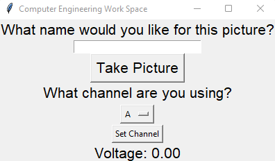

# CS370_Breadboard_Workstation_Project
Camera.py  
 This script uses the libcamera-jpeg tool to capture images with our Pi camera.   
 It has two functionalities: capturing an image and setting a specified name, if none is provided, setting a default name.  
  
Pins.py  
 This script uses the Adafruit CircuitPython library to receive inputs from an MCP3008 analog-to-digital converter (ADC).   
 It has three functionalities: reading analog signals from 8 channels, switching between these channels, and returning analog voltage readings.  
   
noGUI.py  
 This Python script defines user functionality for Camera.py and Pins.py without a GUI.  
 It has two functionalities that the user can interact with in a terminal, upon starting they will be prompted with this message:  
   
           Commands:  
           C - take photo  
           V - display voltage ('q' to exit)  
             
 The user can take a photo by pressing C and display live analog voltage readings by pressing V which will continue to display until they enter q.  

GUI.py  
This Python script defines user functionality for Camera.py and Pins.py with  GUI. 
It has three functionalities that the user can interact with on the GUI, upon starting they will be prompted with this page:  
   
The user can enter in the text box and take a picture that will be saved with that name, select a channel for voltmeter reading, and view live voltmeter readings from the selected channel.  
   
example.py  
 This Python script loops every .5 seconds using the method readOnce() from Pins.py to read ADC input for voltage.   
 It has two functionalities: if the voltage value equals or exceeds 1.5 turn on an LED light and take a picture titled "example".  
   
example.jpg  
 Image generated from running example.py and reading a voltage of 1.5 or higher.   
